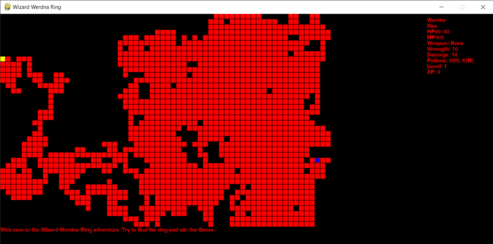
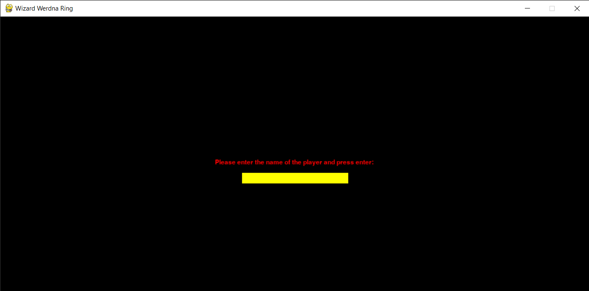
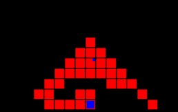
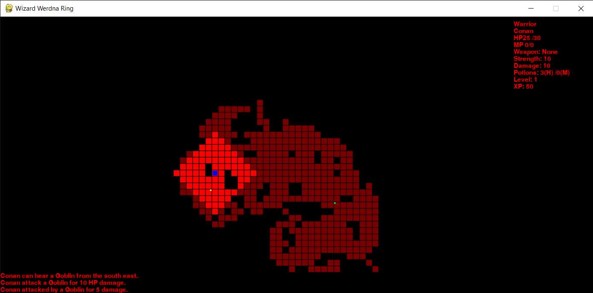
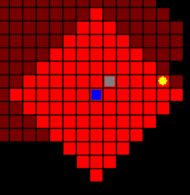
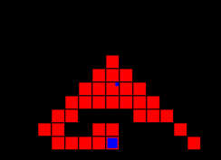
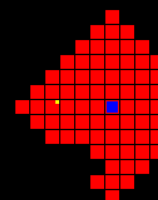
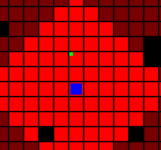
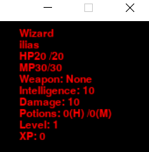
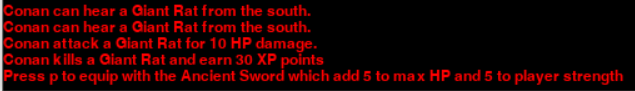

# **Wizard Werdna Ring**
The code is written in python and creates a rogulike game.

- [**Wizard Werdna Ring**](#wizard-werdna-ring)
  - [**Scope**](#scope)
  - [**Caves/Enviroment**](#cavesenviroment)
  - [**Hero**](#hero)
    - [**Hero Depiction**](#hero-depiction)
    - [**Hero Visiblity**](#hero-visiblity)
    - [**Hero Actions**](#hero-actions)
      - [**Movement of the Hero**](#movement-of-the-hero)
      - [**Attack**](#attack)
      - [**Rest**](#rest)
      - [**Health potion usage**](#health-potion-usage)
      - [**Mana potion usage**](#mana-potion-usage)
      - [**Picking up weapons**](#picking-up-weapons)
    - [**Hero level**](#hero-level)
  - [**Enemies**](#enemies)
  - [**Items**](#items)
    - [**Potions**](#potions)
      - [**Health Potion**](#health-potion)
      - [**Mana Potion**](#mana-potion)
    - [**Weapon**](#weapon)
      - [**Sword**](#sword)
      - [**Staff**](#staff)
      - [**Item Depiction**](#item-depiction)
      - [*Werdna ring*](#werdna-ring)
  - [**Hero Status**](#hero-status)
  - [**Game Log**](#game-log)
  - [**Summary**](#summary)

## **Scope**
Main goal of the game is the Hero to find the Wizard Werdna Ring. In order to achive this the Hero searches a cave complex. Each cave is inabited by hostile creatures ready to attack our Hero. The ring is located at the tenth and final cave.

## **Caves/Enviroment**
The enviroment of the game consist of caves, each cave is a 2d space of tiles. The tiles can be floor (where the Heroes and the enemies can walk), wall and stairs. The stair tile is the entrance for the next cave. The color for each tile is red for the floor, black for the wall and yellow for the stair. 

*An example of cave depiction*

## **Hero**
You can choose between two types of Hero at the first screen of the game by pressing 1 for the Warrior type and 2 for the Wizard. A screenshot of the introductory screen is given below.

In the second screen you can insert the name of the Hero. Screenshot is given below.

### **Hero Depiction**
The Hero is depicted as a blue square.

### **Hero Visiblity**
The Hero can see for a diastance equal with 6 map tiles and that means that the Hero can see if the tiles are floor, stair or wall and also if there are any enemies or items. For the tiles that are outside the visibility range there are two visibilty categories, the unknown which means that the Hero can't see anything for this tile and the fogged which means a tile that the Hero can see only if it is a wall or floor and if the tile has any item (the enemies are invisible in this case).

*A depiction of the game after some movements of the Hero is given above. The bright red for the tiles means that are inside the Hero's visibilty and the les opaque red means that the tiles visibility type is fogged.*

### **Hero Actions**
The game actions follows the Hero actions, in simple words first the Hero performs one action and in response the environment reacts.
#### **Movement of the Hero**
Generally the Hero can move in the four directions using the keys w to move up,a to move left,s to move down and d to move right. For each movement the Hero moves for one tile in the map/cave.

#### **Attack**
In order to attack you have to hit the space button.
Each type of Hero perform different type of attack. The Warrior use sword and performs attack on an enemy only if he is on the next tile, if there are more than one enemy nearby the Hero attacks the one with the less hitpoints. The wizard use staff as weapon and use spels to attack. For this reason the wizard can attack any enemy inside his visibility and if there are more than one enemy the attack priority is distance and then the enemy hitpoints. Each time the wizard attacks he consum 5 mana points.
The damage that the Hero performs depends on the Hero level and the weapon the Hero posses. The attribute that characterize the damage the Hero can perform is the strength for the warrior and the inteligence for the wizard.

#### **Rest**
By pressing the r key the Hero rest and earns 4 hitpoints. If he is a wizard earns and 4 mana points. Keep in mind that each time you are pressing the r button there is a 25% possibility an enemy to appear. **Hint:** if your palyer has seen the stair, he cannot rest except he has 35 tiles distance from the stair tile.   

#### **Health potion usage**
You have to press h in order to use one health potion and earn 20 hitpoints.

#### **Mana potion usage**

This action is performed only when the Hero is wizard type. By pressing the m key the Hero uses one mana potion and earns 20 mana points.

#### **Picking up weapons**
When the palyer moves in a tile that has a weapon the Hero can pick that weapon by pressing the p key. The sword weapon that the warrion can aquire add two boost one to the maximum hitpoints the Hero can has and one to the Hero strenght. The staff is the weapon that the wizard can aquire and add three boost one to the maximum hitpoints, to the maximum mana points and to the inteligence. 

### **Hero level**
The Hero has level starting from the first and ending at the fifth. Each level determines the Hero max hitpoints for both types of Hero, max mana points and inteligence for the wizard type of Hero and strength for the warrior type. Also the level determines the enemies the Hero encounter and the weapons he can find. In order to change level the Hero gathers experience points by killing enemies. In the following tables are presented the level of the Hero and the corresponding required experience points, in order the Hero to reach each level and the attributes the Hero has at each level.**Hint:** When the Hero change level and his hitpoints are 2/3 of the maximum hitpoints of the previous level automatically half of the health potion he posses are used.

|Level  |Experience Points  |Hitpoints  |Strength  |
|:-----:|:-----------------:|:---------:|:--------:|
|   1   |  0-299            |     30    |    10    |
|   2   |  300-899          |     60    |    20    |
|   3   |  900-2699         |     80    |    25    |
|   4   |  2700 - 6499      |     90    |    30    |
|   5   |  6500 - 1399      |     100   |    35    |

Table 1: Warrior level and corresponding attributes

|Level  |Experience Points  |Hitpoints  |Mana points| Inteligence|
|:-----:|:-----------------:|:---------:|:--------:|:-----------:|
|   1   |  0-299            |     20    |    30    |      10     |
|   2   |  300-899          |     40    |    50    |      20     |
|   3   |  900-2699         |     50    |    70    |      30     |
|   4   |  2700 - 6499      |     55    |    90    |      40     |
|   5   |  6500 - 1399      |     60    |    110   |      50     |

Table 2: Wizard level and corresponding attributes

## **Enemies**
The enemies of the game are created during the movement of the Hero and when the Hero  rests. The kind of the enemy depends from the Hero level. The enemies has a specific visibility, hitpoints, strength and experience points which they return when they are killed. They are immovable until the Hero is inside their visibility, then they move towards the Hero trying to reduce the distance and finaly to attack the Hero reducing his hitpoints by the strength amount each enemy has. A table with the name the corresponding level the Hero must have in order the specific enemy to be created and its attributes is given below.

|Hero Level  |Enemy name  |Hitpoints  |Strength| Experience points|Visibiliti|Depiction|
|:-----:|:-----------------:|:---------:|:--------:|:-----------:|:-----------:|:-------:|
|   1-2   |  Giant Rat      |     5    |    2    |      30     |         4      | Gray Square|
|   1-3   |  Goblin         |     15    |    5    |      50     |        7      |Yellow Circle|
|   3-4   |  Gray Slime     |     30    |    8    |      80     |        2      |White Square|
|   4-5   |  Orc Grunt      |     40    |    10    |     100     |       6      |Green Square|
|   3-5   |  Orc Warlord    |     50    |    12   |      120     |       7      |Dark Green Square|
|   4-5   |  Ettin          |     60    |    20   |      150     |       9      |Dark Grey Circle|
|   3-5   |  Skeleton       |     20    |    30   |      100     |       4      |White Recangle|
|     5   |  Wyrm           |     80    |    20   |      200     |       5      |Magenta Square|
|     5   |  Vampire        |     50    |    30   |      400     |       10     |Black Circle|

Table 3:Enemies of the Game

The depiction of each enemy is a square, rectangle or circle with different color. In the above table is given the depiction for each enemy.

*Example of enemies depiction (a giant rat and a Golbin)*

## **Items**

In the game the tiles can have items stored on them. The two major item categories are potions and weapon.There is also a special case of item the Werdna ring. Details are given below.

### **Potions**
The potions are used for the restoration of the hitpoints and mana points of the Hero. The potion are acquired by our Hero automatically when he pass a tile in which it is stored.
#### **Health Potion**
Restores by 20 hotpoints the hp of the Hero.
#### **Mana Potion**
Restores by 20 Mana points the mp of the hero if he is wizard type.
### **Weapon**
There are two types of weapon in the game, sword and staff. The sword can be possessed by a warrior and the staff by a wizard. Each weapon boosts specific attributes of our Hero. The weapon and the total boost they offer depends on the level of the Hero during they creation. The total boost is shared among the boost the weapon offer randomly. In the following table the Hero level and the corresponding total boost are given. 
|Hero Level|Total Boost|
|:--------:|:---------:|
|1|10|
|2|20|
|3|30|
|4|40|
|5|60|

*Table 4: Weapon total boost per Hero level*

#### **Sword**
The sword offers boost at the maximum hitpoints a warrior can has and boosts the strength of the Hero and as consequence the damage he can induce. 

#### **Staff**
The staff boosts the maximum hitpoints and mana points a wizard can has and also boosts the inteligence of the Hero and as consequence the damage he can induce.

#### **Item Depiction**
The depiction of the item is with a small square at the corner of the tile they are stored. The potion items are depicted on the right upper corner of the tile and the color is blue for the health potion and yellow for the mana potion. The weapons are depicted on the left upper corner with one color (yellow) for both.

  

*Health potion depiction (left), Mana potion depiction (center) weapon depiction (right)*
#### *Werdna ring*
This is a special case of item. Is the item for which our Hero starts his adventure. When the Hero find it, he can press p and end the game. The depiction of the ring is the same with the stairs (a yellow tile).

## **Hero Status**
The status of the hero is depicted on the right upper corner of the game screen outside the map depiction. The information that are presented are the type of the Hero, the name of the Hero, the hitponts of the hero, the mana points of the hero, the name of the weapon he posses, the strenght of the warrior or the inteligence of the wizard, the damage the Hero can induce (the Hero strength or inteligenge plus the boost from the weapon he posses), the potions the Hero posses, the Hero level and finaly the Hero current experience points.

*Depiction of the Hero status*

## **Game Log**
The game log is depicted at the lower left corner screen below the map screen. It prints 5 last game messages. The mesages corcen varius game aspects,like the location of the creation of an enemy regarding the Hero positin, the health/mana points restored after the usage of one potion, the weapon name and the boosts it offers e.t.c. 

*An instance of the game log*

## **Summary**
This game will be used for the development of artificial inteligence (AI) agents. The one kind of agent will playe the game from the Hero prespective and the others agents will control the enemies of the game. The project is in its initial development. Further information regardin the AI part of the game will be available as soon as possible. For the moment enjoy the game(With the less inteligent enemies).