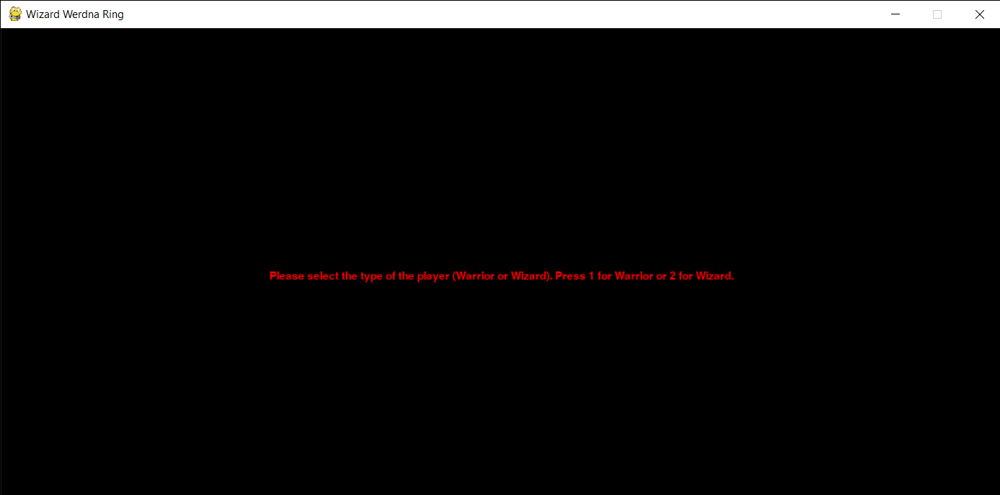

# Wizard Werdna Ring
The code is written in python and creates a rogulike game. 
## Scope
Main goal of the game is the player to find the Wizard Werdna Ring. In order to achive this the player searche a cave complex. Each cave is inabited by hostile creatures ready to attack our player. The ring is located at the tenth and final cave.

## Player
You can chose between two types of player.

